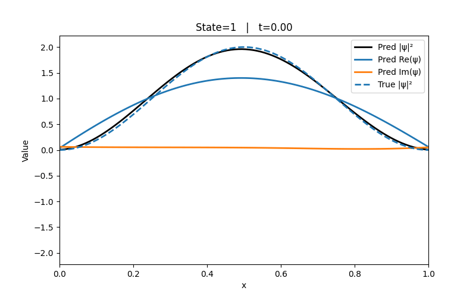
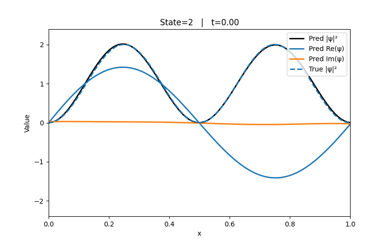

# pinn-schrodinger
Physics-informed neural networks (PINNs) for solving the time-dependent (and time-independent) Schrödinger Equation in 1D. The network outputs the real and imaginary parts of
ψ(x,t) and is trained by minimizing a physics-aware loss (PDE residual + constraints).

## Equations
Time-dependent Schrödinger equation (TDSE)

$$
i\hbar\ \frac{\partial \psi(x,t)}{\partial t}
=\left[-\frac{\hbar^2}{2m}\frac{\partial^2}{\partial x^2}+V(x,t)\right]\psi(x,t).
$$

In the code I assume natural units ℏ=1, 𝑚=1.

## Boundary and initial conditions
- Dirichlet boundary conditions: $\psi(0,t)=\psi(L,t)=0$, with $L$ chosen according to the problem.
- Initial condition: $\psi(x,0)=\psi_0(x)$, where $\psi_0(x)$ is an analytic eigenstate of the chosen $V$.

## Loss function

The solution is modeled by including the contraints into the neural network loss function. The constraints include
- PDE residual, split into real/imag. Minimize sum square.
- Boundary loss 
- Initial condition loss
- Normalization loss: enforce unit norm at each time
- Energy-drift penalty

$$
\langle H\rangle(t)=\int_0^{L}\!\Big[\tfrac12\,|\partial_x\psi(x,t)|^2 + V(x)\,|\psi(x,t)|^2\Big]\,dx.
$$

penalize $(\langle H\rangle(t) - \langle H\rangle(0))^2$ to discourage numerical “mode collapse” to lower energies

## Infinite square well
- Potential

$$
V(x)=
\begin{cases}
0, & 0\le x\le 1, \\
\infty, & \text{otherwise}.
\end{cases}
$$

- Eigenstates and energies $\(\hbar = m = 1\)$

$$
\phi_n(x)=\sqrt{2}\,\sin(n\pi x),\qquad
E_n=\tfrac12\,n^2\pi^2,\qquad n=1,2,\dots
$$

Time evolution of states n=1 (left) and n=2 (right) using PINNs

  
  

